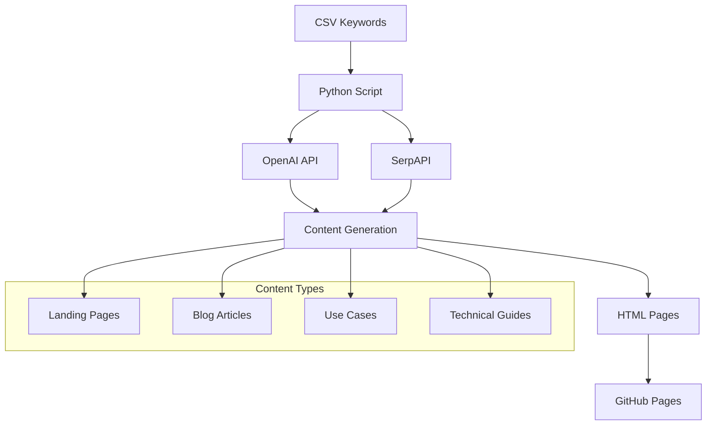

# HappyScribe AI Content Generator 🚀

[](https://www.python.org/downloads/)
[](https://openai.com/)
[](LICENSE)
[](https://monsiaz.github.io/demo_happyscribe_contents_gen/)

> **An AI-powered SEO content generator that creates comprehensive landing pages, blog articles, and professional use cases for subtitle format conversions.**

Transform your subtitle conversion keywords into complete, SEO-optimized websites with **zero manual writing**. This tool generates landing pages, blog articles, and professional use cases using OpenAI's latest models, enriched with real-time search data from SerpAPI.

## 🌟 Key Features

### 🎯 **Complete Content Ecosystem**
- **Landing Pages**: Conversion-focused pages with comparison tables, FAQs, and technical guides
- **Blog Articles**: 10+ in-depth articles per conversion (1900+ words each)
- **Use Cases**: Professional scenarios for different industries and personas
- **Technical Content**: API integration guides and enterprise workflows

### 🔧 **AI-Powered Generation**
- **OpenAI Integration**: Uses GPT-4-mini for fast, high-quality content
- **SERP Enhancement**: Real-time data from Google search results
- **Smart Parsing**: Robust JSON extraction with fallback mechanisms
- **Concurrent Processing**: Async operations for maximum speed

### 🌐 **Production-Ready Output**
- **Static HTML**: GitHub Pages compatible
- **Responsive Design**: Bootstrap 5 + custom CSS
- **SEO Optimized**: Meta tags, canonical URLs, structured markup
- **Accessibility**: WCAG compliant with proper headings and navigation

## 🏗️ Architecture



## 🚀 Quick Start

### Prerequisites
- Python 3.8+
- OpenAI API key
- SerpAPI key (optional but recommended)

### Installation

```bash
# Clone the repository
git clone https://github.com/monsiaz/demo_happyscribe_contents_gen.git
cd demo_happyscribe_contents_gen

# Create virtual environment
python -m venv .venv
source .venv/bin/activate  # Windows: .venv\Scripts\activate

# Install dependencies
pip install -r settings/requirements.txt
```

### Configuration

Create `settings/keys.txt`:
```
OPENAI_API_KEY=your_openai_key_here
SERPAPI_API_KEY=your_serpapi_key_here
```

### Basic Usage

```bash
# Generate content for one conversion (test mode)
python script.py

# Generate all conversions
python script.py --test=False

# Deploy to GitHub Pages
./deploy.sh
```

## 📊 Content Generation Pipeline

### 1. **Data Input**
- CSV with conversion pairs (SRT→VTT, etc.)
- Keywords and search volumes
- Target personas and use cases

### 2. **SERP Research**
- Related questions from Google
- Organic snippets analysis
- Search suggestions mining

### 3. **AI Content Creation**
- Landing page with comparison tables
- 10 blog articles (how-tos, guides, tools)
- 10 professional use cases
- 3 technical articles (API, automation)
- 3 enterprise use cases

### 4. **HTML Generation**
- Responsive layouts
- SEO meta tags
- Internal linking
- Accessibility features

## 🎛️ Advanced Configuration

### Command Line Options

| Flag | Description | Example |
|------|-------------|---------|
| `--test` | Process only one row | `--test` |
| `--limit N` | Process N rows maximum | `--limit 10` |
| `--concurrency N` | Parallel API calls | `--concurrency 6` |
| `--debug` | Verbose logging | `--debug` |

### Content Customization

Edit prompt templates in `Prompts/`:
- `landing_prompt.txt` - Main conversion pages
- `article_prompt.txt` - Blog articles
- `usecase_prompt.txt` - Professional use cases
- `tech_article_prompt.txt` - Technical guides
- `tech_ideas_prompt.txt` - Technical content planning

### Styling & Branding

Customize appearance in `settings/web_assets/`:
- `style.css` - Custom styles
- `header.png` - Brand logo
- Bootstrap 5 classes for responsive design

## 📈 SEO Features

### **On-Page Optimization**
- ✅ Semantic HTML structure
- ✅ Proper heading hierarchy (H1-H4)
- ✅ Meta descriptions and titles
- ✅ Canonical URLs
- ✅ Internal linking strategy

### **Content Quality**
- ✅ Long-form content (1900+ words)
- ✅ FAQ sections with accordion UI
- ✅ Comparison tables
- ✅ Technical depth for expertise signals
- ✅ User-focused language and examples

### **Technical SEO**
- ✅ Fast loading static pages
- ✅ Mobile-responsive design
- ✅ Clean URL structure
- ✅ Structured markup ready
- ✅ CDN-friendly assets

## 🛠️ Development

### Project Structure
```
happyscribre_ia_content_gen/
├── script.py              # Main generation script
├── Prompts/               # AI prompt templates
│   ├── landing_prompt.txt
│   ├── article_prompt.txt
│   └── ...
├── settings/              # Configuration
│   ├── keys.txt          # API keys (gitignored)
│   ├── srt_contents.csv  # Input data
│   └── web_assets/       # CSS, images
├── demo_site/            # Generated content
├── docs/                 # GitHub Pages deployment
└── deploy.sh            # Deployment script
```

### Key Components

**SEOGenerator Class**
- Async OpenAI API client
- Concurrent request handling
- JSON parsing with fallbacks
- Error handling and retries

**Content Pipeline**
- Template-based prompt generation
- SERP data integration
- Multi-format content creation
- Static HTML compilation

### Testing & Debugging

```bash
# Test with debug output
python script.py --test --debug

# Generate specific number of conversions
python script.py --limit 5 --debug

# Check generated content
ls demo_site/
```

## 🚢 Deployment

### GitHub Pages (Recommended)

```bash
# Generate content
python script.py --test=False

# Deploy to GitHub Pages
./deploy.sh
```

Your site will be available at: `https://username.github.io/repository-name/`

### Manual Deployment

```bash
# Copy to docs folder
rm -rf docs
cp -R demo_site docs

# Commit and push
git add .
git commit -m "deploy $(date +%F_%T)"
git push
```

## 📊 Performance & Metrics

### **Generation Speed**
- ~30 seconds per conversion (10 blogs + 10 use cases)
- Concurrent API calls (6 simultaneous by default)
- Efficient template processing
- Smart caching and fallbacks

### **Output Quality**
- 1900+ words per blog article
- 2300+ words per use case
- Professional tone and structure
- Technical accuracy with API examples
- SEO-optimized formatting

### **Cost Optimization**
- Single model strategy (GPT-4-mini)
- Efficient prompt design
- Retry logic with exponential backoff
- Token usage monitoring

## 🔧 Troubleshooting

### Common Issues

**API Rate Limits**
```bash
# Reduce concurrency
python script.py --concurrency 3
```

**JSON Parsing Errors**
- Script includes automatic fallbacks
- Check debug logs for specific issues
- Retry failed generations

**Missing Content**
```bash
# Verify API keys
cat settings/keys.txt

# Test with single row
python script.py --test --debug
```

### Debug Mode

Enable verbose logging to troubleshoot:
```bash
python script.py --debug
```

## 🤝 Contributing

We welcome contributions! Please see our [Contributing Guide](CONTRIBUTING.md) for details.

### Development Setup
1. Fork the repository
2. Create a feature branch
3. Make your changes
4. Add tests if applicable
5. Submit a pull request

## 📝 License

This project is licensed under the MIT License - see the [LICENSE](LICENSE) file for details.

## 🙏 Acknowledgments

- **OpenAI** for the GPT-4-mini model
- **SerpAPI** for search data enrichment
- **Bootstrap** for responsive design
- **HappyScribe** for the inspiration and API documentation

## 📞 Support

- 📧 **Issues**: [GitHub Issues](https://github.com/monsiaz/demo_happyscribe_contents_gen/issues)
- 📖 **Documentation**: [Wiki](https://github.com/monsiaz/demo_happyscribe_contents_gen/wiki)
- 🌐 **Live Demo**: [GitHub Pages](https://monsiaz.github.io/demo_happyscribe_contents_gen/)

---

**Built with ❤️ by the HappyScribe team**

*Transform your content strategy with AI-powered automation. Generate hundreds of SEO-optimized pages in minutes, not months.* 