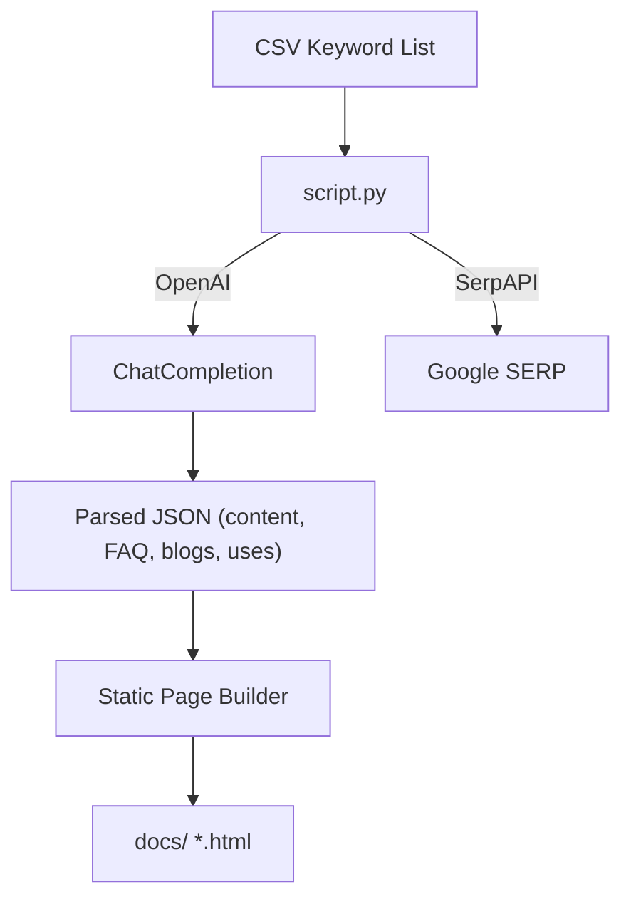

# HappyScribe Subtitle Content Generator

## Project Purpose

This repository contains a small yet powerful **SEO landing-page generator** written in Python.  
It automates the creation of:

* A conversion landing page for every subtitle format pair (eg. *SRT → VTT*)
* Ten in-depth blog articles that expand on the topic
* Ten professional use-case pages tailored to the same conversion

The content is produced with the **OpenAI Chat Completions API** and enriched with context gathered from **SerpAPI** (related searches, questions, organic snippets).  
The output is a static HTML demo site that can be published directly on GitHub Pages or any static host.

---

## High-Level Architecture



### Main Components

1. **`script.py`** – async orchestrator, prompts the model, parses responses, and writes HTML.  
2. **`Prompts/*.txt`** – editable templates for landing, blog, and use-case generation.  
3. **`settings/web_assets/`** – shared CSS, JS, and brand assets (logo).  
4. **`demo_site/`** – generated artefacts, ready for deployment.

---

## Installation

```bash
# Clone repository
 git clone https://github.com/<you>/happyscribe-ia-content-gen.git
 cd happyscribe-ia-content-gen

# Create virtual environment (optional but recommended)
 python -m venv .venv
 source .venv/bin/activate

# Install dependencies
 pip install -r settings/requirements.txt
```

### API Keys

Create `settings/keys.txt` and add your credentials:

```
OPENAI_API_KEY=<your-openai-key>
SERPAPI_API_KEY=<your-serpapi-key>
```

If `SERPAPI_API_KEY` is missing, the script still runs but without related-search enrichment.

---

## Usage

### Quick Test

By default the script runs **in test mode** and only processes one CSV row so that you can iterate quickly:

```bash
python script.py                # generates 1 landing + 10 blogs + 10 use cases
```

### Full Batch Generation

```bash
python script.py --test=False    # or simply flip DEFAULT_TEST_MODE in script.py
```

Optional arguments:

| Flag            | Purpose                                   |
|-----------------|-------------------------------------------|
| `--limit 25`    | Stop after N CSV lines (overrides `--test`)|
| `--concurrency` | Parallel OpenAI calls (default 3)         |
| `--debug`       | Verbose logging                           |

---

## Output Structure

```
 demo_site/
 ├─ convert-srt-to-vtt.html        # landing page
 ├─ blog_1_how-to-convert-srt.html # 10 generated articles
 ├─ use_1_video-editing.html       # 10 generated use cases
 └─ ...
 preview.json                      # full JSON snapshot of model responses
```

Each landing page links automatically to its related articles and use-case pages.  
Conversely, every secondary page includes a *Back to converter* link plus cross-links to its peers.

---

## Customising the Prompts

Edit the files under `Prompts/` to tweak tone, length, or HTML structure.  
The placeholders ( `${KW_PRIMARY}`, `${F1}`, etc.) are substituted at runtime.

You can also experiment with model parameters (temperature, model name) inside `script.py → SEOGenerator`.

---

## Deploying to GitHub Pages

1. Run the generator in full mode so that `demo_site/` is complete.  
2. Commit and push the folder.  
3. In repository settings, choose *Pages* → *Deploy from branch* and select `demo_site/` as root.

GitHub Pages will serve the static site at `https://<user>.github.io/<repo>/`.

---

## Troubleshooting

* **JSONDecodeError** – the script includes fallback repairs, but occasionally the LLM may return malformed JSON. Re-run the script or lower temperature.
* **Rate limits** – adjust `--concurrency` or upgrade plan on OpenAI / SerpAPI.
* **Missing landing page** – ensure the CSV row contained valid data; the landing is generated last once its blogs and use-cases are written.

---

## Roadmap

* Multi-language support
* Automatic image generation (OpenAI Images or Mid-journey) with `` tags
* CLI flag to regenerate only blogs or only use-cases

---

## License

MIT – see `LICENSE` for details.  
Happy hacking! 